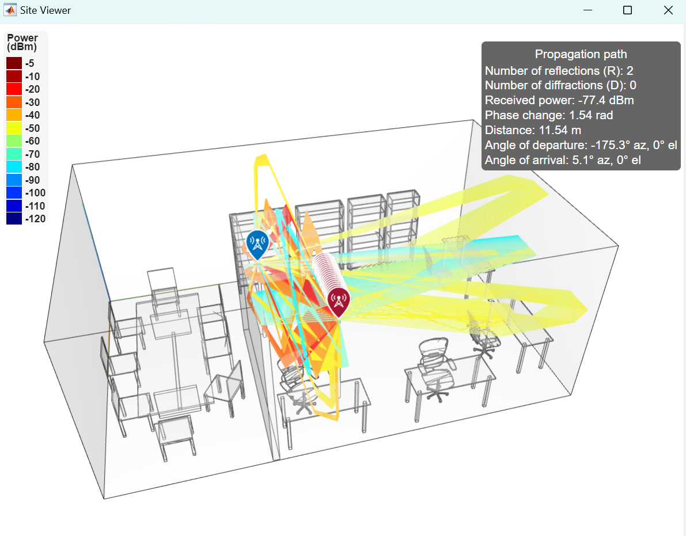

# 📶 CSI Data Collection

CSI data collection is the first step toward the implementation of a practical wireless sensing system. This section introduces one of the most famous Wi-Fi sensing datasets, the Widar3 dataset, so that beginners can quickly get start with wireless sensing with minimal effort. This section also introduces three of the most famous CSI collection tools that researchers can use to try out collecting CSI data with COTS NICs. Finally, this section provides a Matlab-based CSI simulator developed for researchers to cost-effectively and quickly create datasets for testing.

## Widar3.0 Dataset

Open datasets are essential to provide comprehensive knowledge for model training and a unified benchmark for model comparison. Open datasets are even more necessary in the wireless sensing field because RF signals are more sensitive to devices and deployment environments. However, the absence of high-quality and large-scale datasets has become the bottleneck that hindered the progress of wireless sensing technology. Existing wireless sensing datasets suffer from small scales and limited scenarios in 2019 when we started to build the Widar3.0 dataset. Widar3.0[^1] is a wireless sensing dataset for human activity recognition. It is collected from commodity Wi-Fi NICs in the form of RSSI and CSI. It consists of 258,000 instances of hand gestures with a duration of 8,620 minutes and from 75 domains. Widar3 is so far the largest and most comprehensive dataset in this field and receives widespread attention from researchers all over the world. Widar3 dataset is publicly available at IEEE DataPort (official data repository) and continues evolving to contain more types of activities.

## PicoScenes Platform

PicoScenes is a versatile and powerful middleware for CSI-based Wi-Fi sensing research. It is one of the very few tools that support the latest 802.11ac/ax protocols. It supports many prevalent commercial NICs, including Qualcomm Atheros AR9300 (QCA9300), Intel Wireless Link 5300 (IWL5300), Intel AX200 and Intel AX210. PicoScenes supports up to 27 NICs to work concurrently for packet injection and CSI measurement.

PicoScenes is architecturally versatile and flexible. It encapsulates all the low-level features into unified and hardware-independent APIs and exposes them to the upper-level plugin layer. As a result, users can quickly prototype their own measurement plugins.

The data reported by PicoScenes can be parsed in MATLAB as a struct, containing the CSI data of different packets, subcarriers, and antennas. The struct also includes other helpful information such as timestamps, RSSI, and the signal-to-noise ratio (SNR).

The homepage[^2] of this tool can be accessed for more detailed information.

## Intel 5300 NIC CSI Tool

This CSI Tool is built upon the Intel WiFi Wireless Link 5300 802.11n MIMO radios, using a modified firmware and the open-source Linux wireless driver. It includes all the software and scripts required to collect, read, and parse CSI.

The IWL5300 provides 802.11n CSI of 30 subcarrier groups. Each group contains 2 adjacent subcarriers given 20 MHz bandwidth or 4 given 40 MHz bandwidth. Each CSI sample is a complex number, with a signed 8-bit resolution for both real and imaginary parts. One CSI record is a $$A \times 30$$ matrix, where $$M$$ is the number of pairs of transmitting and receiving antennas.

The homepage[^3] of this tool can be accessed for detailed information.

## Atheros CSI Tool

Atheros CSI Tool is an open-source 802.11n measurement and experimentation tool. It enables the extraction of detailed PHY wireless communication information from the Atheros WiFi NICs, including the Channel State Information (CSI), the received packet payload, and other information (the time stamp, the RSSI of each antenna, the data rate, \etc). Atheros-CSI-Tool is built on top of ath9k, an open-source Linux kernel driver supporting Atheros 802.11n PCI/PCI-E chips. Thus, this tool theoretically supports all types of Atheros 802.11n WiFi chipsets. We have tested it on Atheros AR9580, AR9590, AR9344, and QCA9558. Furthermore, Atheros CSI Tool is open source, and all functionalities are implemented in software without any modification to the firmware. Therefore, one can extend the functionalities of Atheros CSI Tool with their own codes under the GPL license.

Atheros-CSI-Tool works on various Linux distributions, \eg, Ubuntu, OpenWRT, Linino, etc. Different Linux distribution works with different hardware. Ubuntu works for personal computers like laptops or desktops. OpenWRT works for embedded devices such as WiFi routers. Linino works for IoT devices, such as Arduino YUN. The official website provides the source code for the Ubuntu version and OpenWRT version of the Atheros CSI tool.

The homepage[^4] of this tool can be accessed for detailed information.

## Wireless Sensing Simulator

The Wireless Sensing Simulator is a CSI simulator developed by the MobiSense group at Tsinghua University. It is developed with MATLAB for researchers to cost-effectively and quickly create CSI datasets for testing.

Wireless Sensing Simulator can simulate the CSI data of any protocol under the 802.11 protocol family, and it can even simulate the CSI data of a cellular network with freely set variables such as bandwidth, center frequency, number of subcarriers, number of antennas, and so on. In Wireless Sensing Simulator, we can use our own modeled 3D scene to complete the simulation, where the location, orientation, and number of access points (APs) and IoT devices are modifiable. The simulation is realized based on the ray tracing model, and the geometrical information (e.g., AoA, AoD, and ToF) of all multipath signals between AP and IoT devices will be available. The figure below demonstrates the simulated communication link between the AP and different IoT devices in an indoor environment.

<figure><figcaption>
Fig. 4. The raytracing process of simulation in an indoor environment.
</figcaption></figure>

We integrate the traditional AoA, ToF, and Doppler spectrum estimation algorithms, and implement a interactive GUI,  which will be described in detail in the CSI Feature Extraction chapter.&#x20;

We have verified the effectiveness of this tool in our recent paper [**Wi-Prox**](#user-content-fn-5)[^5]. Furthermore, Wireless Sensing Simulator has been open-sourced, and all functions are implemented in software. Therefore, one can extend the functionalities of Wireless Sensing Simulator with their own codes under the GPL license.

The [**repo**](#user-content-fn-6)[^6] of this tool can be accessed for detailed information.

[^1]: [Widar3 Dataset](http://tns.thss.tsinghua.edu.cn/widar3.0)

[^2]: [PicoScenes Platform](https://ps.zpj.io)

[^3]: [CSI Tool](https://dhalperi.github.io/linux-80211n-csitool)

[^4]: [Atheros CSI Tool](https://wands.sg/research/wifi/AtherosCSI/)

[^5]: \[1] Gao, Yuchong, et al. "Wi-Prox: Proximity Estimation of Non-Directly Connected Devices via Sim2Real Transfer Learning." GLOBECOM 2023-2023 IEEE Global Communications Conference. IEEE, 2023.

[^6]: [https://github.com/gaoyc01/Wireless-Sensing-Simulator](https://github.com/gaoyc01/Wireless-Sensing-Simulator)
