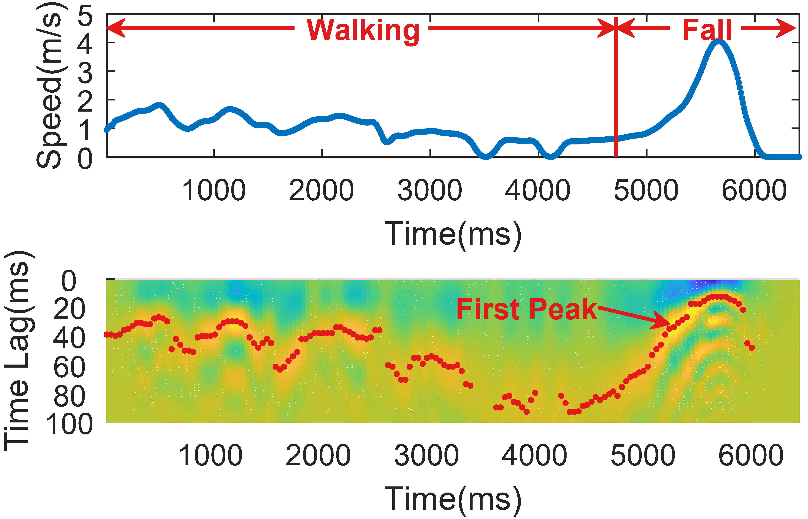

# 🛜 Understanding CSI

Channel state information (CSI) lays the foundation of most wireless sensing techniques, including Wi-Fi sensing, LTE sensing, and so on. CSI provides physical channel measurements in subcarrier-level granularity, and it can be easily accessed from the commodity Wi-Fi network interface controller (NIC).

CSI describes the propagation process of the wireless signal and therefore contains geometric information of the propagation space. Thus, understanding the mapping relationship between CSI and spatial geometric parameters lays the foundation for feature extraction and sensing algorithm design.

This section focuses on two mainstream CSI models: the ray-tracing model and the scattering model. The two models are based on two perspectives of understanding the signal propagation process. Thus, they have unique advantages and apply to different scenarios.

## Ray-tracing Model

In typical indoor environments, a signal sent by the transmitter arrives at the receiver via multiple paths due to the reflection of the radio wave. Along each path, the signal experiences a certain attenuation and phase shift. The received signal is the superimposition of multiple alias versions of the transmitted signal. Therefore, the complex baseband signal strength measured at the receiver at a specific time can be written as follows :

$$
V=\sum_{n=1}^{N}{\lVert V_n \rVert e^{-j\phi_n}},  (1)
$$

where $$V_n$$ and $$\phi_n$$ are the amplitude and phase of the $$n^{th}$$ multipath component (note that the modulation scheme of the signal is implicitly considered), and $$N$$ is the total number of components. On this basis, the recieve signal strength indicator (RSSI) can be written as the received power in decibels (dB):

$$
\mathrm{RSSI} = 10\log_2\left( \lVert V \rVert^2 \right).  (2)
$$

As the superimposition of multipath components, RSSI not only varies rapidly with propagation distance changing at the order of the signal wavelength but also fluctuates over time, even for a static link. A slight change in specific multipath components may result in significant constructive or destructive multipath components, leading to considerable fluctuations in RSSI.

<figure><figcaption>
Fig. 2. Multipath propagations, received signals, and channel responses. 
</figcaption></figure>

The essential drawback of RSSI is the failure to reflect the multipath effect. The wireless channel is modeled as a linear temporal filter to fully characterize individual paths, known as channel impulse response (CIR). Under the time-invariant assumption, CIR $h(t)$ is represented as:

$$
h(t) = \sum_{n=1}^{N}{\alpha_n e^{-j\phi_n} \delta(t - \tau_n)},  (3)
$$

where $$\alpha_n$$, $$\phi_n$$, and $$\tau_n$$ are the complex antenuation, phase, and time delay of the $$n^{th}$$ path, respectively. $$N$$ is the total number of multipath and $$\delta(\cdot)$$ is the Dirac delta function. Each impulse represents a delayed multipath component, multiplied by the corresponding amplitude and phase.

In the frequency domain, the multipath causes frequency-selective fading, which is characterized by channel frequency response (CFR). CFR is essentially the Fourier transform of CIR. It consists of both the amplitude response and the phase response. Figure. 2 demonstrate a multipath scenario, the transmitted signal, the received signal, and the illustrative channel responses. Both CIR and CFR depict a small-scale multipath effect and are used for fine-grained channel measurement. Note that the complex amplitudes and antennuation are concerned in CIR and CFR, while another pair of parameters in terms of the signal power is Power Delay Profile (PDP) and Power Spectrum Density (PSD).

CIR and CFR are measured by decoupling the transmitted signal from the received signal. Specifically, in the time domain, the received signal $$r(t)$$ is the convolution of transmitted signal $$s(t)$$ and channel impulse response $$h(t)$$:

$$
r(t) = s(t) \otimes h(t), (4)
$$

which indicates the recieved signal is generated from the transmit signal after it propagating from multipath channel.

Similarly, in the frequency domain, the received signal spectrum $$R(f)$$ is the multiplication of the transmitted signal spectrum $$S(f)$$ and the channel frequency response $$H(f)$$:

$$
R(f) = S(f) H(f). (5)
$$

Note that the $$R(f)$$ and $$S(f)$$ are the Fourier transform of the recieved signal $$r(t)$$ and the transmitted signal $$s(t)$$ respectively. In this way, Eqn.4 and Eqn.5 forms a beautiful "symmetric" relationship.

As demonstrated in Eqn.4 and Eqn.5, CIR can be derived from the deconvolution operation of received and transmitted signals, and CFR can be treated as the ratio of the received and the transmitted spectrums. Compared with multiplication, the convolution operation is generally time-consuming. Therefore, in most cases, the device focuses on calculating the CFR, and the CIR can be further derived from the CFR using the inverse Fourier transform :

$$
h(t) = \frac{1}{P_s}\mathfrak{F}^{-1}\left\{ S^*(f)R(f) \right\},  (6)
$$

where $$\mathfrak{F}^{-1}$$ denotes the inverse Fourier transform, $$*$$ is the conjugate operator, and $$P_s$$ approximates the transmitted signal power.

Although the derivation of CIR and CFR is independent of the modulation scheme, it could be more convenient to implement the process on commercial devices with specific modulation schemes. For the wireless standard where the orthogonal frequency division modulation (OFDM) is adopted (e.g., 802.11a/g/n/ac/ax), the amplitude and phase sampled on each subcarrier can be treated as a sampled version of the signal spectrum $$S(f)$$. On this basis, a sampled version of $$H(f)$$ can be easily get from the OFDM receivers.

Recent advances in the wireless community make it possible to get the sampled version of CFR from commercial-off-the-shelf (COTS) Wi-Fi NICs. The extracted CFR are often refered to as a series of complex numbers, which depicts the amplitude and phase of each subcarrier:

$$
H(f_j)=\lVert H(f_j) \rVert e^{\angle H(f_j)}, (7)
$$

where $$H(f_j)$$ is a sample at the $$j^{th}$$ subcarrier, with $$\angle H(f_k)$$ denotes its phase. Most research paper treat the CFR at sampled at different subcarriers as the CSI data, which can be written as $$\boldsymbol{H} = \{ H(f_j) \ \vert \ j \in [1, J], j \in \mathbb{N} \}$$, where $$J$$ denotes the total number of subcarriers.

The ray-tracing model establishes the relationship between geometric properties of the signal propagation space and the CSI data. Theoretically, by analyzing the multipath signal, various types of geometric information (e.g., the propagation distance, the reflection points) can be derived. Therefore, the ray-tracing model is widely adopted in wireless localization and tracking tasks. In addition, many wireless detection and sensing systems also extract geometric features based on the ray-tracing models, and further put them into machine learning models for regression or classification.

A significant drawback of the ray-tracing model is that it is based on a simple environmental assumption. Therefore, in a complex environment where the signal undergoes diffraction or is disturbed by various types of noise, it becomes difficult to accurately recover all the spatial information by only limited CSI data.

## Scattering Model

The above-mentioned ray-tracing model characterizes signals with multiple propagation paths, which may not apply to rich-scattering environments. To enable wireless sensing in more complex scenarios, some worksestablish the scattering model for CSI measurements with Wi-Fi.

The CSI data reported by commodity Wi-Fi NIC can be modeled as:

$$
H(f,t) = \sum_{n=1}^{N}{\alpha_n(f,t)e^{-j\phi_n(f, t)}}, (8)
$$

where $$N$$ is the total number of reflection paths, $$\alpha_n$$ is the amplitude attenuation of path $$n$$, $$\phi_n$$ is the corresponding phase.

<figure><figcaption>
Fig. 3. Wi-Fi signals in rich-scattering environment.
</figcaption></figure>

As shown in Figure 3, the scattering model treats all the objects in indoor environments as scatterers  that diffuse the signals to all directions. The CSI observed by the receiver is added up with the portions contributed by the static (furniture, walls, etc.) and dynamic (arms, legs, etc.) scatterers. Intuitively, each scatter is deemed as a virtual Tx. Such modeling can be applied to typical indoor scenarios, where the rooms are crowded with furniture, and signals could propagate in almost all directions. On this basis, we can dismiss the specific signal propagation path and only statistically investigate the relationship between the observed CSI and the moving speed.

We decompose the observed CSI into the portions contributed by individual scatterers:

$$
H(f,t) = \sum_{o \in \Omega_s(t)}{H_o(f,t)} + \sum_{p \in \Omega_d(t)}{H_p(f,t)}, (9)
$$

where $$\Omega_s(t)$$ and $$\Omega_d(t)$$ are the sets of static and dynamic scatterers, $$H_p(f,t)$$ is the portion of observed CSI contributed by $$p^{th}$$ dynamic scatterer. For each scatterer, the diffused components undergo anonymous propagation processes and eventually add up at the receiver. Try to a three-dimensional coordinate with its origin at the $$p^{th}$$ scatterer and its z-axis align with the scatterer's moving direction, the representation of $$H_p(f,t)$$ is further decomposed as follows :

$$
H_p(f,t) = \int_{0}^{2\pi}\int_{0}^{\pi}{h_p(\alpha,\beta,f,t)\exp(-jkv_p\cos(\alpha)t)\mathrm{d} \alpha \mathrm{d} \beta}, (10)
$$

where $$k=2\pi/\lambda$$ and $$\lambda$$ is the signal wavelength, $$v_p$$ is the speed of the $$p^{th}$$ dynamic scatterer, $$\alpha$$ and $$\beta$$ are the azimuth and elevation angles, $$\exp(-jkv_i\cos(\alpha)t)$$ represents the phase shift of the signal on direction $$(\alpha,\beta)$$. $$h_p(\alpha,\beta,f,t)$$ is the portion of observed CSI contributed by $$p^{th}$$ scatterer on direction $$(\alpha,\beta)$$. Inherited from the physical properties of EM waves, $$h_p(\alpha,\beta,f,t)$$ can be viewed as a circularly-symmetric Gaussian random variable. For $$\forall p, q \in \Omega_d$$ and $$(\alpha_1,\beta_1) \neq (\alpha_2,\beta_2)$$, $$h_p(\alpha_1,\beta_1,f,t)$$ is independent of $$h_q(\alpha_2,\beta_2,f,t)$$.

Based on Eqn.9 and Eqn.10, we are able to derive the statistical property by analyzing the autocorrelation function (ACF) of $$H(f,t)$$:

$$
\begin{split} \rho_{H}(f,\tau)&\triangleq \frac{\mathrm{Cov}[H(f,t),H(f,t+\tau)]}{\mathrm{Cov}[H(f,t),H(f,t)]}\\ &=\frac{\sum_{p \in \Omega_d}{\sigma_p^2(f) \mathrm{sinc}(kv \tau)}}{\sum_{p \in \Omega_d}{\sigma_p^2(f)}} \approx \mathrm{sinc}(kv\tau), \end{split} (11)
$$

where $$\mathrm{Cov}[\cdot,\cdot]$$ is the covariance between two random variables, $$\sigma_p^2(f)$$ is the variance of $$h_p(\alpha,\beta,f,t)$$, $$\mathrm{sinc}(kv \tau) = \frac{\sin(kv \tau)}{kv \tau}$$, and $$\tau$$ is the time lag.

For some human activities like fall and walking, we can assume that the dynamic scatterers are mainly on the torso and have similar speeds $$v$$. Thus, Eqn. 11 is approximated with a much simpler form: $$\rho_{H}(f,\tau) \approx \mathrm{sinc}(kv\tau)$$. Using this formulation, we have quantitatively established the relationship between the huamn speed and the ACF of CSI. In practice, the speed $$v$$ is extracted by matching the first peak of the $$\mathrm{sinc}(x)$$ function and the first peak of ACF:

$$
v=\frac{x_0}{k \tau_0}=\frac{x_0 \lambda}{2\pi \tau_0}, (12)
$$

where $$x_0$$ is the constant value representing the location of the first peak of $$\mathrm{sinc}(x)$$function, $$\tau_0$$ is the time lag corresponding to the first peak of the ACF.

As a straightforward example, we let a volunteer to walk and fall in a heavily furnished room and extract the speed with the CSI collected from a Wi-Fi link located in another room. As is shown in Figure 4, even with non-line-of-sight (NLoS) occlusions and multipath pollution, the walking speed and fall speed are estimated consistently, demonstrating its robustness to environmental diversity.

<figure><figcaption>
Fig. 4. The estimated speed and the ACF of CSI signals.
</figcaption></figure>

The scattering model is generally applicable to various speed-oriented sensing The scattering model generally applies to various speed-oriented sensing tasks such as intrusion detection and fall detection. As a statistical model, it has unique advantages in complex scenarios.

However, the scattering model fails to construct a correspondence between CSI and geometric parameters directly, and thus is generally not applicable to precise localization and tracking tasks.
