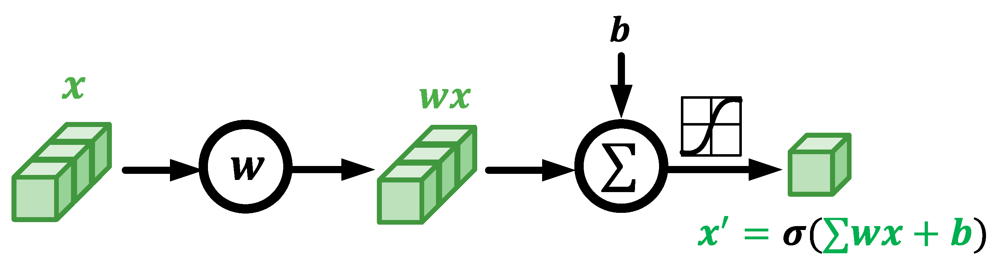

# 🖥️ Wireless Sensing with Deep Learning


All the code and data in this tutorial are available. Click [**here**](http://tns.thss.tsinghua.edu.cn/wst/wst\_code.zip) to download it!&#x20;

This section introduces a series of learning algorithms, especially the prevalent deep neural network models such as CNN and RNN, and their applications in wireless sensing. This section also proposes a complex-valued neural network to accomplish learning and inference based on wireless features efficiently.


This section will present a working example to demonstrate how to apply different types of complex-valued neural networks for wireless sensing. Besides, we also provide a traditional real-valued CNN for DFS classification.

Specifically, we use commodity Wi-Fi to recognize six human gestures. The gestures are illustrated in Figure. 9. We deploy a Wi-Fi transmitter and six receivers in a typical classroom, and the device setup is sketched in Figure. 10. The users are asked to perform gestures at the five marked locations and to five orientations. The data samples can be found in our widar3.0 dataset .&#x20;


<figure><figcaption><p>Fig. 9. Sketches of gestures evaluated in the experiment.</p></figcaption></figure>

<figure><figcaption><p>Fig. 10. The setup of Wi-Fi devices for gesture recognition task.</p></figcaption></figure>

## Data Preperation

The `TrainDataset` class in PyTorch is designed for loading and processing Wi-Fi CSI data, which is commonly employed in wireless communication and sensing applications. Here is a description of the functions within this class:

* **`init(self, transform=None)`** initializes the dataset by reading a log file named `shuffle.txt`, which contains a list of paths to data files. The class uses the first 90% of these paths for training and stores them. If a `transform` parameter is provided, it will be used for data transformation; otherwise, the default `transformers_preprocess` method is applied.
* **`len(self)`** returns the number of data entries in the dataset, which corresponds to the length of the training paths list.
* **`getitem(self, index)`** retrieves the data item at the specified index `index` in the dataset. This method first obtains the path, then uses the `get_mat` method to load and transform the data file, followed by the `transform` method for further data processing. Finally, it extracts the label using the `get_label` method from the path, and returns a tuple of the data and label.
* **`get_label(self, path)`** extracts the label from the path of the data file. The label is parsed from the filename, which includes several parameters separated by `-` where the second parameter is used as the label and is converted to an integer type.
* **`get_mat(self, path)`** loads the data file using the `scipy.io.loadmat` function to load `.mat` files and extracts an array named `cfr_array`. It then transforms the array into a complex tensor in PyTorch format.
* **`transformers_preprocess(self, x)`**  preprocesses the complex tensor. This method first separates the real and imaginary parts of the tensor, then rearranges and interpolates them to a specific size, standardizing different lengths of the time dimension to `1000`, and finally merges them back into a complex tensor.


```python
import torch
from torch.utils.data import Dataset
import torch.nn.functional as F
from einops import rearrange
import math
from scipy.io import loadmat

class TrainDataset(Dataset):
    def __init__(self, transform=None):
        super().__init__()
        self.path_log = "./csi/shuffle.txt"
        # In shuffle.txt, the first 90% are for training, the last 10% are for testing
        self.path_list = []
        with open(self.path_log, 'r') as txt:
            for line in txt:
                self.path_list.append(line[:-1])
        self.train_len = math.floor(len(self.path_list)*0.9)
        self.path_list = self.path_list[:self.train_len]
        if transform:
            self.transform = transform
        else:
            self.transform = self.transformers_preprocess

    def __len__(self):
        return len(self.path_list)
    
    def __getitem__(self, index):
        path = self.path_list[index]
        tensor = self.get_mat(path)
        if self.transform:
            tensor = self.transform(tensor)
        label = self.get_label(path)
        return tensor, label
    
    def get_label(self, path):
        path = path.split("/")[-1][:-4]
        id, a, b, c, d, Rx = path.split("-")
        label = int(a)-1
        return label
       
    def get_mat(self, path):
        array = loadmat(path)['cfr_array']
        tensor = torch.from_numpy(array)
        tensor = tensor.to(torch.complex64)
        return tensor

    def transformers_preprocess(self, x):
        real_part = torch.real(x)
        real_part = rearrange(real_part, "l d -> 1 d l")
        real_part = F.interpolate(real_part, size=1000, mode='nearest-exact')
        real_part = rearrange(real_part, "1 d l -> l d")
        imag_part = torch.imag(x)
        imag_part = rearrange(imag_part, "l d -> 1 d l")
        imag_part = F.interpolate(imag_part, size=1000, mode='nearest-exact')
        imag_part = rearrange(imag_part, "1 d l -> l d")
        complex_tensor = torch.complex(real_part ,imag_part)
        return complex_tensor
```


Similarly, we have implemented the `TestDataset` class, which is almost identical to the `TrainDataset` class, except for a change in line 24 of the code. While the `TrainDataset` selects the first 90% of the data from `shuffle.txt` for training purposes, the `TestDataset` uses the remaining 10% of the data from `shuffle.txt` for testing.

```python
class TestDataset(Dataset):
    def __init__(self, transform=None):
        super().__init__()
        self.path_log = "./csi/shuffle.txt"
        # In shuffle.txt, the first 90% are for training, the last 10% are for testing
        self.path_list = []
        with open(self.path_log, 'r') as txt:
            for line in txt:
                self.path_list.append(line[:-1])
        self.train_len = math.floor(len(self.path_list)*0.9)
        self.path_list = self.path_list[self.train_len:]    # Difference betten TestDataset and TrainDataset
        if transform:
            self.transform = transform
        else:
            self.transform = self.transformers_preprocess
```

## Training and Testing

Our training script is designed to train complex-valued AlexNet, ResNet, and Transformer models. Below is a detailed description of the code:

* **`init_weights(model)`** initializes the model weights. It checks the type of the model, and if it is a linear or convolutional layer, it initializes the weights into a normal distribution.
* **`train(model_type, device)`** is the main training function. It accepts the model type (“AlexNet”, “ResNet", or "Transformer”) and the device (such as CUDA or CPU) as parameters.
  1. Firstly, it creates an instance of the model according to the `model_type`.
  2. Then, it applies the `init_weights` function to initialize the model weights.
  3. The model is then moved to the specified device.
  4. Training parameters are defined, including a batch size of 64, epochs set to 200, the loss function as cross-entropy loss suitable for multi-class tasks, an initial learning rate (which varies depending on the model), optimizer (SGD or AdamW), and a learning rate scheduler (StepLR, reducing the learning rate by half every ten rounds).
  5. An instance of `TrainDataset` is created, and a `DataLoader` is used to load data in batches.
  6. Training is conducted for the specified number of epochs, each including forward propagation, loss calculation, backpropagation, and optimization steps.
  7. After each epoch, the loss and accuracy are printed, and the learning rate is updated using the learning rate scheduler.
  8. Every 5 epochs, the model is saved, and the `test` function is used to evaluate the model, printing out the test loss and accuracy.
* **`train("AlexNet", device = torch.device("cuda:0"))`** calls the `train` function to train the AlexNet model and specifies the use of a CUDA device. The commented lines are for training the ResNet and Transformer models, respectively.

```python
import torch
from torch import nn
from train_dataset import TrainDataset
from torch.optim.lr_scheduler import StepLR
from AlexNet import AlexNet
from Resnet import ResNet18
from Transformer import RF_Transformer
from test import test

def init_weights(model):
    if type(model) in [nn.Linear, nn.Conv3d, nn.Conv2d, nn.Conv1d]:
        nn.init.normal_(model.weight, std=0.03)

def train(model_type, device):
    print("model_type: ", model_type)
    if model_type == "AlexNet":
        model = AlexNet()
    elif model_type == "ResNet":
        model = ResNet18()
    elif model_type == "Transformer":
        model = RF_Transformer()
    model.apply(init_weights)
    model.to(device)
    batch_size = 64
    epoch = 200
    myloss = nn.CrossEntropyLoss().to(device)
    init_lr = 3e-3
    optimizer = torch.optim.SGD(model.parameters(), lr = init_lr)
    # optimizer = torch.optim.AdamW(model.parameters(), lr = init_lr)
    scheduler = StepLR(optimizer, step_size=10, gamma=0.5)
    train_dataset = TrainDataset()
    train_dataloader = torch.utils.data.DataLoader(
        dataset=train_dataset,
        batch_size=batch_size,
        shuffle=True
    ) 
    for i in range(epoch):
        model.train()  
        total_loss = 0
        correct = 0
        print("-----{} epoch for training-----".format(i + 1))
        for data in train_dataloader:
            csi, label = data
            csi = csi.to(device)
            label = label.to(device)
            x = model(csi)
            loss = myloss(x, label)
            loss = loss.requires_grad_()
            total_loss += loss * x.size(0)
            model.zero_grad()
            loss.backward()
            optimizer.step()
            correct += (x.argmax(axis=1) == label).sum().item()
        print("Loss:{}, acc:{}".format(total_loss/train_dataset.__len__(), correct/train_dataset.__len__()))
        scheduler.step()
        if (i+1)%5==0:  # for every 5 epochs to save model and test
            save_path = "/srv/csj/tutorial_submit/model_file/" + model_type + "_model_{}.pth".format(i+1)
            torch.save(model, save_path)
            acc, avg_loss = test(device, save_path)
            print("-----{} epoch for testing-----".format(i + 1))
            print("Loss:{}, acc:{}".format(acc, avg_loss))
            
train("AlexNet", device = torch.device("cuda:0"))
# train("ResNet", device = torch.device("cuda:0"))
# train("Transformer", device = torch.device("cuda:0"))
```

We have defined a testing function `test`, which is used to assess the performance of deep learning models trained on the Wi-Fi CSI dataset. Here is a detailed description of the code:

**`test(device, model_path)`** accepts the device (such as CUDA or CPU) and the model path as parameters.

1. Firstly, it creates an instance of `TestDataset`.
2. Then, it uses `DataLoader` to load data, with a batch size set to 1 and without random shuffling.
3. Next, it loads the pretrained model from the specified path using the `torch.load` function, and moves the model to the specified device.
4. It calls `model.eval()` to set the model to evaluation mode, which deactivates features like dropout and batch normalization that are used during training.
5. A cross-entropy loss function `myloss` is defined and moved to the specified device.
6. It initializes the count of correct predictions `correct` and the total loss `total_loss`.
7. It iterates over the `DataLoader`, performing forward propagation on each data item, calculating the loss, and accumulating both the loss and the number of correct predictions.
8. Finally, it calculates the accuracy `accuracy` and the average loss `avg_loss`, and returns these two values.

## Model Construction

Drawing inspiration from classic models in the field of computer vision, we have developed versions of AlexNet, ResNet-18, and ViT that support complex numbers, tailored specifically for the characteristics of Wi-Fi CSI data. These three models can handle input tensors of complex numbers with the shape `[batch, 1000, 90]`, where `1000` represents the temporal length and `90` represents the spatial dimensions of the Wi-Fi CSI (3 receivers, each with 30 subcarriers). For AlexNet and ResNet-18, the data from the three different receivers are treated as three channels; for the ViT model, we adopt a technique similar to that used in computer vision for image patching, reorganizing the tensor shape to shorten the temporal dimension and expand the spatial dimension.

Building on this foundation, and referencing the latest developments in the field of wireless sensing, we have implemented a complex-valued **spectrogram learning neural network (**[**SLNet**](#user-content-fn-1)[^1]**)** for the classification of complex-valued DFS.&#x20;

To facilitate comparison, we also provide a conventional real-valued CNN+RNN architecture that classifies based on the magnitude of DFS. This dual approach allows researchers and developers to evaluate the effectiveness of complex-valued neural processing against traditional real-valued methods, providing insight into the nuances of handling complex signal data in practical applications.

### Complex-Valued Neural Networks

Complex-valued neural networks, compared to traditional real-valued neural networks, are better suited to the data type of Channel State Information (CSI). Real and complex neurons exhibit significant differences. As shown in the figure below, complex neurons can effectively combine information from both the real and imaginary parts, often resulting in superior performance. This ability to handle complex numbers inherently aligns with the nature of CSI data, which includes both amplitude and phase information, enabling more nuanced and effective processing of wireless signal characteristics.

<figure><figcaption><p>Fig. Real-valued neurons.</p></figcaption></figure>

<figure><figcaption><p>Fig. Complex-valued nerons.</p></figcaption></figure>

#### 1. AlexNet

We have developed a variant of the classic AlexNet, adapted to process complex data using PyTorch. This complex-valued neural network is specifically designed to leverage the inherent properties of complex data in wireless communication signals, such as Wi-Fi CSI. Below is a comprehensive breakdown of the code structure:

**1.1. Library Imports:**

* **`torch`:** Core library of PyTorch, used for constructing and training neural networks.
* **`torch.nn`:** Provides essential building blocks for neural network layers.
* **`torch.nn.functional`:** Offers functions for activations, loss calculations, and more.
* **`einops`:** A versatile library for tensor operations, simplifying dimension transformations.
* **`complex.complex_layers`:** Custom layers designed for handling complex data operations.

**1.2. `AlexNet` Class Definition:**

* The class inherits from `nn.Module`.
* **Initialization in `__init__`:**
  * **Convolution Layers (`conv1` to `conv5`):** These layers are adapted to handle complex data types `torch.complex64`.
  * **Complex Max Pooling Layers (`maxpool1` to `maxpool3`):** Specifically designed for pooling operations on complex tensors.
  * **Fully Connected Layers (`fc1` to `fc3`):** fc1 handles complex data, while `fc2` and `fc3` process real numbers.
  * **Complex to Real Layer (`c2r`):** Transforms complex tensor outputs into real tensor formats.
  * **Dropout Layers (`dp1` and `dp2`):** dp1 is designed for complex tensors to prevent overfitting, and dp2 handles real tensors.
  * **Activation Functions (`relu` and `real_relu`):** relu is used for complex tensors, and real\_relu is used for real tensors.

**1.3. `Forward` Method:**

* Defines the forward propagation path through the network.
* The input tensor `x` is first re-arranged using the `einops.rearrange` function to match the dimensions required by the convolution layers.
* The data flows through a sequence of convolution layers, followed by complex pooling and activation functions.
* `Dropout` layers are applied to reduce the risk of overfitting.
* Data passes through the fully connected layers to produce the final output `x`.

```python
import torch
import torch.nn as nn
import torch.nn.functional as F
from einops import rearrange
from complex.complex_layers import *

class AlexNet(nn.Module):
    def __init__(self, num_classes=6):
        super(AlexNet, self).__init__()
        self.conv1 = nn.Conv2d(in_channels=3, out_channels=96, kernel_size=[51, 4], stride=[18, 1], padding=[0, 0], dtype=torch.complex64)
        self.maxpool1 = ComplexMaxPool2d(kernel_size = [3, 2], stride=[2, 1])
        self.conv2 = nn.Conv2d(in_channels=96, out_channels=256, kernel_size=[5, 5], stride=[1, 1], padding=[2, 2], dtype=torch.complex64)
        self.maxpool2 = ComplexMaxPool2d(kernel_size = [3, 3], stride=[2, 2])
        self.conv3 = nn.Conv2d(in_channels=256, out_channels=384, kernel_size=[3, 3], stride=[1, 1], padding=[1, 1], dtype=torch.complex64)
        self.conv4 = nn.Conv2d(in_channels=384, out_channels=384, kernel_size=[3, 3], stride=[1, 1], padding=[1, 1], dtype=torch.complex64)
        self.conv5 = nn.Conv2d(in_channels=384, out_channels=256, kernel_size=[3, 3], stride=[1, 1], padding=[1, 1], dtype=torch.complex64)
        self.maxpool3 = ComplexMaxPool2d(kernel_size = [3, 3], stride=[2, 2])
        self.fc1 = nn.Linear(in_features=6400, out_features=4096, dtype=torch.complex64)
        self.c2r = ComplexToReal()
        self.fc2 = nn.Linear(in_features=4096, out_features=4096)
        self.fc3 = nn.Linear(in_features=4096, out_features=num_classes)
        self.dp1 = ComplexDropout(0.3)
        self.dp2 = nn.Dropout(0.1)
        self.relu = ComplexReLU()
        self.real_relu = nn.ReLU()

    def forward(self, x):
        x = rearrange(x, "b l (c d) -> b c l d", c = 3)
        x = self.relu(self.conv1(x))
        x = self.maxpool1(x)
        x = self.relu(self.conv2(x))
        x = self.maxpool2(x)
        x = self.relu(self.conv3(x))
        x = self.relu(self.conv4(x))
        x = self.relu(self.conv5(x))
        x = self.maxpool3(x)
        x = rearrange(x, "b c l d -> b ( c l d )")
        x = self.dp1(self.relu(self.fc1(x)))
        x = self.c2r(x)
        x = self.dp2(self.real_relu(self.fc2(x)))
        x = self.fc3(x)
        return x
```

#### 2. ResNet-18

This PyTorch-based model adapts the classic ResNet-18, originally designed for image recognition, to handle complex-valued data. The modification allows for efficient processing of complex data, such as Wi-Fi CSI or other signal processing applications, enhancing the model's ability to capture intricate patterns and relationships in the data.

**2.1. Class Definitions:**

* **`ResNetBasicBlock`:** Implements the basic residual block of ResNet-18, which includes two convolutional layers and batch normalization layers, coupled with a complex ReLU activation function. This block forms the core building block, facilitating the residual learning that is characteristic of ResNet architectures.
* **`ResNetDownBlock`:** Implements a downsampling residual block of ResNet-18. It includes an additional convolutional layer and batch normalization layer designed to reduce the dimensions of the feature maps, aiding in efficient data processing and reducing computational load.
* **`ResNet18`:** Implements the complete ResNet-18 architecture. It begins with an initial convolutional layer, followed by batch normalization and max pooling layers. The model features four residual layers, each containing multiple residual blocks, leading to a global average pooling layer. The architecture concludes with a fully connected layer and a layer that converts complex tensors to real tensors, preparing the output for classification or other tasks.

**2.2. `Forward` Method:**

* The input tensor `x` is first re-arranged using the `einops.rearrange` function to fit the dimension requirements of the initial convolutional layer.
* Data passes sequentially through the convolutional layers, batch normalization, activation functions, residual blocks, and pooling layers. These layers collectively maintain and refine feature information while preventing the degradation problem typical in deep networks.
* A global average pooling layer reduces the dimensions of the feature maps, concentrating the essential information into a smaller form factor.
* A complex to real conversion layer transforms the complex tensor into a real tensor, making it suitable for real-valued outputs needed for classification.
* The final output `x` is produced by the fully connected layer.

```python
import torch
import torch.nn as nn
import torch.nn.functional as F
from einops import rearrange
from complex.complex_layers import *

class ResNetBasicBlock(nn.Module):
    def __init__(self, in_channels, out_channels, kernel_size, stride, padding):
        super(ResNetBasicBlock, self).__init__()
        self.conv1 = ComplexConv2d(in_channels, out_channels, kernel_size=kernel_size[0], stride=stride[0], padding=padding[0])
        self.bn1 = ComplexBatchNorm2d(out_channels)
        self.conv2 = ComplexConv2d(out_channels, out_channels, kernel_size=kernel_size[1], stride=stride[1], padding=padding[1])
        self.bn2 = ComplexBatchNorm2d(out_channels)
        self.relu = ComplexReLU()

    def forward(self, x):
        output = self.conv1(x)
        output = self.relu(self.bn1(output))
        output = self.conv2(output)
        output = self.bn2(output)
        return self.relu(x + output)

class ResNetDownBlock(nn.Module):
    def __init__(self, in_channels, out_channels, kernel_size, stride, padding):
        super(ResNetDownBlock, self).__init__()
        self.extra = nn.Sequential(
            ComplexConv2d(in_channels, out_channels, kernel_size=kernel_size[0], stride=stride[0], padding=padding[0]),
            ComplexBatchNorm2d(out_channels)
        )
        self.conv1 = ComplexConv2d(in_channels, out_channels, kernel_size=kernel_size[1], stride=stride[1], padding=padding[1])
        self.bn1 = ComplexBatchNorm2d(out_channels)
        self.conv2 = ComplexConv2d(out_channels, out_channels, kernel_size=kernel_size[2], stride=stride[2], padding=padding[2])
        self.bn2 = ComplexBatchNorm2d(out_channels)
        self.relu = ComplexReLU()

    def forward(self, x):
        extra_x = self.extra(x)
        out = self.conv1(x)
        out = self.relu(self.bn1(out))
        out = self.conv2(out)
        out = self.bn2(out)
        return self.relu(extra_x + out)

class ResNet18(nn.Module):
    def __init__(self, num_classes=6):
        super(ResNet18, self).__init__()
        self.conv1 = ComplexConv2d(3, 64, kernel_size=[111,3], stride=[8,1], padding=[0,0])
        self.bn1 = ComplexBatchNorm2d(64)
        self.maxpool = ComplexMaxPool2d(kernel_size=3, stride=[2,1], padding=1)
        self.layer1 = nn.Sequential(ResNetBasicBlock(64, 64, [3, 3], [1, 1], [1, 1]),
                                    ResNetBasicBlock(64, 64, [3, 3], [1, 1], [1, 1]))
        self.layer2 = nn.Sequential(ResNetDownBlock(64, 128, [1, 3, 3], [[2,1], [2,1], 1], [0, 1, 1]),
                                    ResNetBasicBlock(128, 128, [3, 3], [1, 1], [1, 1]))
        self.layer3 = nn.Sequential(ResNetDownBlock(128, 256, [1, 3, 3], [2, 2, 1], [0, 1, 1]),
                                    ResNetBasicBlock(256, 256, [3, 3], [1, 1], [1, 1]))
        self.layer4 = nn.Sequential(ResNetDownBlock(256, 512, [1, 3, 3], [2, 2, 1], [0, 1, 1]),
                                    ResNetBasicBlock(512, 512, [3, 3], [1, 1], [1, 1]))
        self.avgpool = nn.AdaptiveAvgPool2d(output_size=(1, 1))
        self.c2r = ComplexToReal()
        self.fc = nn.Linear(512, num_classes)
        self.relu = ComplexReLU()

    def forward(self, x):
        x = rearrange(x, "b l (c d) -> b c l d", c = 3)
        x = self.relu(self.bn1(self.conv1(x)))
        x = self.maxpool(x)
        x = self.layer1(x)
        x = self.layer2(x)
        x = self.layer3(x)
        x = self.layer4(x)
        x = self.avgpool(x)
        x = rearrange(x, "b d 1 1 -> b d")
        x = self.c2r(x)
        x = self.fc(x)
        return x
```

#### 3. RF-Transformer

The RF-Transformer is a PyTorch-based model that leverages the Transformer architecture, traditionally used in natural language processing, adapted here for sequence data embedded with complex features. This model is particularly tailored for multi-class classification tasks on Wi-Fi CSI data, utilizing an encoder-only structure.

**3.1. `RF_Transformer` Class Definition:**

* Inherits from `nn.Module`.
* **Initialization in `__init__`:**
  * **encoder:** A complex-valued Transformer encoder designed to process sequence data with complex features.
  * **c2r (Complex to Real):** A layer that transforms complex tensors into real tensors, preparing them for final output processing.
  * **mlp (Multi-Layer Perceptron):** A complex-valued MLP that further processes the output from the encoder.
  * **classifier:** A sequence of fully connected layers that maps the processed features to class categories.

**3.2 Forward Method of `RF_Transformer` Class:**

* **Input Handling:**
  * The input `x` is initially transformed into a complex tensor using `torch.stack` along with `torch.real` and `torch.imag` functions.
* **Processing Path:**
  * Dimension transformation is applied via the `einops.rearrange` function, mimicking the operation of segmenting images into patches as in Vision Transformers (ViT).
  * A class token is added to the beginning of the sequence, similar to the ViT model, which is used for the final classification.
* **Data Processing through Encoder:**
  * The sequence data, now augmented with a class token, passes through the complex Transformer encoder.
  * The output corresponding to the class token is extracted and processed through the complex MLP.
  * A complex to real conversion layer then transforms the complex tensor into a real tensor.
* **Output Generation:**
  * The final output `x` is produced through the fully connected layer sequence.

<pre class="language-python"><code class="lang-python"><strong>import torch
</strong>import torch.nn as nn
import torch.nn.functional as F
from einops import rearrange
from complex.complex_module import *

class RF_Transformer(nn.Module):
    def __init__(self, num_classes=6, seglen=8, origin_dim=720, dim=720, heads=8, layers=8, dropout=0.0):
        super(RF_Transformer, self).__init__()

        self.num_classes = num_classes
        self.seglen = seglen
        self.encoder_origin_dim = origin_dim
        self.dim = dim
        self.heads = heads
        self.layers = layers
        self.dropout = dropout
        self.encoder = ComplexTransformerEncoder(
                        origin_dim = self.encoder_origin_dim,
                        key_dim = self.dim,
                        query_dim = self.dim,
                        value_dim = self.dim,
                        hidden_dim = self.dim,
                        norm_shape = self.dim,
                        ffn_input_dim = self.dim,
                        ffn_hidden_dim = self.dim,
                        num_heads = self.heads,
                        num_layers = self.layers,
                        dropout = self.dropout)

        self.c2r = ComplexToReal()

        self.mlp = ComplexMLP(in_features = self.dim, out_features = self.dim )

        self.classifier = nn.Sequential(
            nn.Linear(self.dim, self.dim),  
            nn.ReLU(),
            nn.Dropout(self.dropout),        
            nn.Linear(self.dim, self.num_classes)
        )

    def forward(self, x):
        x = torch.stack((torch.real(x), torch.imag(x)), dim=-1)
        x = rearrange(x, "b (x s) d I -> b x (s d) I", s = self.seglen)
        class_token = torch.zeros(x[:,0:1].shape).to(x.device)
        x = torch.cat((class_token, x), dim = 1)
        x = self.encoder(x)
        x = x[:,0]
        x = self.mlp(x)
        x = self.c2r(x)
        x = self.classifier(x)
        return x
</code></pre>


### Real-Valued Neural Networks

This part introduces a series of real-valued learning algorithms, especially the prevalent deep neural network models such as CNN and RNN, and their applications in wireless sensing.

#### 1. Real-valued CNN

Convolutional Neural Network (CNN) contributes to the recent advances in understanding images, videos, and audios. Some works have exploited CNN for wireless signal understanding in wireless sensing tasks and achieved promising performance. This part will present a working example to demonstrate how to apply CNN for wireless sensing. The data samples can be found in our released dataset. We extract DFS from raw CSI signals and feed them into a CNN network. The network architecture is shown in Figure. 11.

<figure><figcaption><p>Real-valued CNN</p></figcaption></figure>

We now introduce the implementation code in detail.

First, some necessary packages are imported. We use Keras API with TensorFlow as the backend to demonstrate how to implement the neural network.

```python
import os,sys
import numpy as np
import scipy.io as scio
import tensorflow as tf
import keras
from keras.layers import Input, GRU, Dense, Flatten, Dropout, Conv2D, Conv3D, MaxPooling2D, MaxPooling3D, TimeDistributed, Bidirectional, Multiply, Permute, RepeatVector, Concatenate, Dot, Lambda
from keras.models import Model, load_model
import keras.backend as K
from sklearn.metrics import confusion_matrix
from keras.backend.tensorflow_backend import set_session
from sklearn.model_selection import train_test_split
```

Then we define some parameters, including the hyperparameters and the data path. The fraction of testing data is defined as 0.1. To simplify the problem, we only use six gesture types in the widar3.0 dataset.

```
fraction_for_test = 0.1
data_dir = 'widar30dataset/DFS/20181130/'
ALL_MOTION = [1,2,3,4,5,6]
N_MOTION = len(ALL_MOTION)
T_MAX = 0
n_epochs = 200
f_dropout_ratio = 0.5
n_gru_hidden_units = 64
n_batch_size = 32
f_learning_rate = 0.001
```

The program begins with loading data with the predefined function `load_data`. The loaded data are split into train and test by calling the API function `train_test_split`. The labels of the training data are encoded into the one-hot format with the predefined function `onehot_encoding`.

<pre><code><strong># Load data
</strong>data, label = load_data(data_dir)
print('\nLoaded dataset of ' + str(label.shape[0]) + ' samples, each sized ' + str(data[0,:,:,:,:].shape) + '\n')

# Split train and test
[data_train, data_test, label_train, label_test] = train_test_split(data, label, test_size=fraction_for_test)
print('\nTrain on ' + str(label_train.shape[0]) + ' samples\n' +\
    'Test on ' + str(label_test.shape[0]) + ' samples\n')

# One-hot encoding for train data
label_train = onehot_encoding(label_train, N_MOTION)
</code></pre>

After loading and formatting the training and testing data, we defined the model with the predefined function \lstinline{build\_model}. After that, we train the model by calling the API function \lstinline{fit}. The input data and label are specified in the parameters. The fraction of validation data is specified as 0.1.

```python
model = build_model(input_shape=(T_MAX, 6, 121, 1), n_class=N_MOTION)
model.summary()
model.fit({'name_model_input': data_train},{'name_model_output': label_train},
        batch_size=n_batch_size,
        epochs=n_epochs,
        verbose=1,
        validation_split=0.1, shuffle=True)
```

After the training process, we evaluate the model with the test dataset. The predictions are converted from one-hot format to integers and are used to calculate the confusion matrix and accuracy.

```python
# Testing...
print('Testing...')
label_test_pred = model.predict(data_test)
label_test_pred = np.argmax(label_test_pred, axis = -1) + 1

# Confusion Matrix
cm = confusion_matrix(label_test, label_test_pred)
print(cm)
cm = cm.astype('float')/cm.sum(axis=1)[:, np.newaxis]
cm = np.around(cm, decimals=2)
print(cm)

# Accuracy
test_accuracy = np.sum(label_test == label_test_pred) / (label_test.shape[0])
print(test_accuracy)
```

The predefined `onehot_encoding` function convert the label to one-hot format.

```python
def onehot_encoding(label, num_class):
    # label(ndarray)=>_label(ndarray): [N,]=>[N,num_class]
    label = np.array(label).astype('int32')
    label = np.squeeze(label)
    _label = np.eye(num_class)[label-1]
    return _label
```

The predefined `load_data` function is used to load all data samples and labels from a directory. Each file in the directory corresponds to a single data sample. Each data sample is normalized with the predefined `normalize_data` function. It is worth noting that the data samples have different time durations. We use a predefined `zero_padding` function to make their durations the same as the longest one.

```python
def load_data(path_to_data):
    global T_MAX
    data = []
    label = []
    for data_root, data_dirs, data_files in os.walk(path_to_data):
        for data_file_name in data_files:

            file_path = os.path.join(data_root,data_file_name)
            try:
                data_1 = scio.loadmat(file_path)['doppler_spectrum']    # [6,121,T]
                label_1 = int(data_file_name.split('-')[1])
                location = int(data_file_name.split('-')[2])
                orientation = int(data_file_name.split('-')[3])
                repetition = int(data_file_name.split('-')[4])
                
                # Downsample
                data_1 = data_1[:,:,0::10]

                # Select Motion
                if (label_1 not in ALL_MOTION):
                    continue

                # Normalization
                data_normed_1 = normalize_data(data_1)
                
                # Update T_MAX
                if T_MAX < np.array(data_1).shape[2]:
                    T_MAX = np.array(data_1).shape[2]                
            except Exception:
                continue

            # Save List
            data.append(data_normed_1.tolist())
            label.append(label_1)
            
    # Zero-padding
    data = zero_padding(data, T_MAX)

    # Swap axes
    data = np.swapaxes(np.swapaxes(data, 1, 3), 2, 3)   # [N,6,121,T_MAX]=>[N,T_MAX,6,121]
    data = np.expand_dims(data, axis=-1)                # [N,T_MAX,6,121]=>[N,T_MAX,6,121,1]

    # Convert label to ndarray
    label = np.array(label)

    # data(ndarray): [N,T_MAX,6,121,1], label(ndarray): [N,]
    return data, label
```

The `normalize_data` function is used to normalize the loaded data samples. Each data sample has a dimension of $\[6, 121, T]$, in which the number "6" represents the number of Wi-Fi receivers, the number "121" represents the frequency bins, and the "T" represents the time durations. To normalize a sample, we scale the data to be in the range of $\[0, 1]$ for each time snapshot.

```python
def normalize_data(data_1):
    # data(ndarray)=>data_norm(ndarray): [6,121,T]=>[6,121,T]
    data_1_max = np.amax(data_1,(0,1),keepdims=True)    # [6,121,T]=>[1,1,T]
    data_1_min = np.amin(data_1,(0,1),keepdims=True)    # [6,121,T]=>[1,1,T]
    data_1_max_rep = np.tile(data_1_max,(data_1.shape[0],data_1.shape[1],1))    # [1,1,T]=>[6,121,T]
    data_1_min_rep = np.tile(data_1_min,(data_1.shape[0],data_1.shape[1],1))    # [1,1,T]=>[6,121,T]
    data_1_norm = (data_1 - data_1_min_rep) / (data_1_max_rep - data_1_min_rep + sys.float_info.min)
    return  data_1_norm
```

The `zero_padding` function is used to align all the data samples to have the same duration. The padded length is specified by the parameter `T_MAX`.

```Python
def zero_padding(data, T_MAX):
    # data(list)=>data_pad(ndarray): [6,121,T1/T2/...]=>[6,121,T_MAX]
    data_pad = []
    for i in range(len(data)):
        t = np.array(data[i]).shape[2]
        data_pad.append(np.pad(data[i], ((0,0),(0,0),(T_MAX - t,0)), 'constant', constant_values = 0).tolist())
    return np.array(data_pad)
```

In this function, we define the network structure. The input layer is specified with the API function `Input`, which has the parameters to define the input shape, data type, and the layer name. Following the input layer, we use a three-dimensional convolutional layer, a max-pooling layer, and two fully connected layers. The output layer is specified with the API function `Output`, which has the parameters to define the activation function, the dimension, and the name. At last, we finalize the model with the API function `Model` and `compile`. The optimizer is specified to \lstinline{RMSprop}, and the loss is specified to `categorical_crossentropy`.

```python
def build_model(input_shape, n_class):
    model_input = Input(shape=input_shape, dtype='float32', name='name_model_input')    # (@,T_MAX,6,121,1)

    # CNN
    x = Conv3D(16,kernel_size=(5,3,6),activation='relu',data_format='channels_last',\
        input_shape=input_shape)(model_input)   # (@,T_MAX-4,6,121,1)=>(@,T_MAX-4,4,116,16)
    x = MaxPooling3D(pool_size=(2,2,2))(x)      # (@,T_MAX-4,4,116,16)=>(@,T_MAX-4,2,58,16)

    x = Flatten()(x)                            # (@,T_MAX-4,2,58,16)=>(@,(T_MAX-4)*2*58*16)
    x = Dense(256,activation='relu')(x)         # (@,(T_MAX-4)*2*58*16)=>(@,256)
    x = Dropout(f_dropout_ratio)(x)
    x = Dense(128,activation='relu')(x)         # (@,256)=>(@,128)
    x = Dropout(f_dropout_ratio)(x)
    model_output = Dense(n_class, activation='softmax', name='name_model_output')(x)  # (@,128)=>(@,n_class) 

    # Model compiling
    model = Model(inputs=model_input, outputs=model_output)
    model.compile(optimizer=keras.optimizers.RMSprop(lr=f_learning_rate),
                    loss='categorical_crossentropy',
                    metrics=['accuracy']
                )
    return model
```

## 2. Real-valued RNN

Recurrent Neural Network (RNN) is designed for modeling temporal dynamics of sequences and is commonly used for time series data analysis like speech recognition and natural language processing. Wireless signals are highly correlated over time and can be processed with RNN. Some workshave demonstrated the potential of RNN for wireless sensing tasks. In this section, we will present a working example of combining CNN and RNN to perform gesture recognition with Wi-Fi. The experimental settings are the same as in \sect{sec:cnn}. We also extract DFS from the raw CSI as the input feature of the network. The network architecture is shown in Figure. 12.

We now introduce the implementation code in detail.

&#x20;\*\* Fig. 12. Recurrent Neural Network architecture. \*\*

Most of the code is the same as in \sect{sec:cnn} except for the model definition. To define the model, we use two-dimensional convolutional layer and max-pooling layer on the dimensional except for the time dimension of the data. We adopt the GRU layer as the recurrent layer.

```python
def build_model(input_shape, n_class):
    model_input = Input(shape=input_shape, dtype='float32', name='name_model_input')    # (@,T_MAX,6,121,1)

    # CNN+RNN
    x = TimeDistributed(Conv2D(16,kernel_size=(3,6),activation='relu',data_format='channels_last',\
        input_shape=input_shape))(model_input)              # (@,T_MAX,6,121,1)=>(@,T_MAX,4,116,16)
    x = TimeDistributed(MaxPooling2D(pool_size=(2,2)))(x)   # (@,T_MAX,4,116,16)=>(@,T_MAX,2,58,16)

    x = TimeDistributed(Flatten())(x)                       # (@,T_MAX,2,58,16)=>(@,T_MAX,2*58*16)
    x = TimeDistributed(Dense(128,activation='relu'))(x)    # (@,T_MAX,2*58*16)=>(@,T_MAX,128)
    x = TimeDistributed(Dropout(f_dropout_ratio))(x)
    x = TimeDistributed(Dense(64,activation='relu'))(x)     # (@,T_MAX,128)=>(@,T_MAX,64)

    x = GRU(n_gru_hidden_units,return_sequences=False)(x)   # (@,T_MAX,64)=>(@,64)
    x = Dropout(f_dropout_ratio)(x)
    model_output = Dense(n_class, activation='softmax', name='name_model_output')(x)  # (@,64)=>(@,n_class) 

    # Model compiling
    model = Model(inputs=model_input, outputs=model_output)
    model.compile(optimizer=keras.optimizers.RMSprop(lr=f_learning_rate),
                    loss='categorical_crossentropy',
                    metrics=['accuracy']
                )
    return model
```

## Real-valued Adversarial Learning

Except for the basic neural network components, some high-level network architectures also play essential roles in wireless sensing. Similar to computer vision tasks, wireless sensing also suffer from domain misalignment problem. Wireless signals can be reflected by the surrounding objects during propagation and will be flooded with target-irrelevant signal components. The sensing system trained in one deployment environment can hardly be applied directly in other settings without adaptation. Some works try to adopt adversarial learning techniques to tackle this problem and achieve promising performance. This section will give an example of how to apply this technique in wireless sensing tasks. Specifically, we build a gesture recognition system with Wi-Fi, similar to that in \sect{sec:cnn}. We try to achieve consistent performance across different human locations and orientations. The network architecture is shown in Figure. 13.

We now introduce the implementation code in detail.

&#x20;\*\* Fig. 13. Adversarial learning network architecture. \*\*

In the Widar3.0 dataset , we collect gesture data when the users stand at different locations. As discussed in \sect{sec:DFS}, human locations have significant impact on the DFS measurements. To mitigate this impact, we treat human locations as different domains and build an adversarial learning network to recognize gestures irrespective of domains. In the program, we first load data, labels, and domains from the dataset and split them into train and test. Both label and domain are encoded into the one-hot format.

```python
# Load data
data, label, domain = load_data(data_dir)
print('\nLoaded dataset of ' + str(label.shape[0]) + ' samples, each sized ' + str(data[0,:,:,:,:].shape) + '\n')

# Split train and test
[data_train, data_test, label_train, label_test, domain_train, domain_test] = train_test_split(data, label, domain, test_size=fraction_for_test)
print('\nTrain on ' + str(label_train.shape[0]) + ' samples\n' +\
    'Test on ' + str(label_test.shape[0]) + ' samples\n')

# One-hot encoding for train data
label_train = onehot_encoding(label_train, N_MOTION)
domain_train = onehot_encoding(domain_train, N_LOCATION)
```

After loading and formating data, we built the network and trained it from scratch. The training data, label, and domain are passed to the API function `fit` for training.

```python
# Train Model
model = build_model(input_shape=(T_MAX, 6, 121, 1), n_class=N_MOTION, n_domain=N_LOCATION)
model.summary()
model.fit({'name_model_input': data_train},{'name_model_output_label': label_train, 'name_model_output_domain': domain_train},
        batch_size=n_batch_size,
        epochs=n_epochs,
        verbose=1,
        validation_split=0.1, shuffle=True)
```

After the training process finishes, we evaluate the network with the test samples. Note that the adversarial network has both label and domain prediction outputs. We only use the label output for accuracy evaluation.

```python
# Testing...
print('Testing...')
[label_test_pred,_] = model.predict(data_test)
label_test_pred = np.argmax(label_test_pred, axis = -1) + 1

# Confusion Matrix
cm = confusion_matrix(label_test, label_test_pred)
print(cm)
cm = cm.astype('float')/cm.sum(axis=1)[:, np.newaxis]
cm = np.around(cm, decimals=2)
print(cm)

# Accuracy
test_accuracy = np.sum(label_test == label_test_pred) / (label_test.shape[0])
print(test_accuracy)
```

Different from that in \sect{sec:cnn}, we load data, label, and domain in the `load_data` function. The domain is defined as the location of the human, which is embedded in the file name.

```python
def load_data(path_to_data):
    global T_MAX
    data = []
    label = []
    domain = []
    for data_root, data_dirs, data_files in os.walk(path_to_data):
        for data_file_name in data_files:

            file_path = os.path.join(data_root,data_file_name)
            try:
                data_1 = scio.loadmat(file_path)['doppler_spectrum']    # [6,121,T]
                label_1 = int(data_file_name.split('-')[1])
                location_1 = int(data_file_name.split('-')[2])
                orientation_1 = int(data_file_name.split('-')[3])
                repetition_1 = int(data_file_name.split('-')[4])
                
                # Downsample
                data_1 = data_1[:,:,0::10]

                # Select Motion
                if (label_1 not in ALL_MOTION):
                    continue

                # Normalization
                data_normed_1 = normalize_data(data_1)
                
                # Update T_MAX
                if T_MAX < np.array(data_1).shape[2]:
                    T_MAX = np.array(data_1).shape[2]                
            except Exception:
                continue

            # Save List
            data.append(data_normed_1.tolist())
            label.append(label_1)
            domain.append(location_1)
            
    # Zero-padding
    data = zero_padding(data, T_MAX)

    # Swap axes
    data = np.swapaxes(np.swapaxes(data, 1, 3), 2, 3)   # [N,6,121,T_MAX]=>[N,T_MAX,6,121]
    data = np.expand_dims(data, axis=-1)                # [N,T_MAX,6,121]=>[N,T_MAX,6,121,1]

    # Convert label and domain to ndarray
    label = np.array(label)
    domain = np.array(domain)

    # data(ndarray): [N,T_MAX,6,121,1], label(ndarray): [N,], domain(ndarray): [N,]
    return data, label, domain
```

To define the network, we use a CNN layer and an RNN layer as the feature extractor, which is similar to that in \sect{sec:rnn}. In the gesture recognizer and domain discriminator, we use two fully-connected layers and an output layer activated by `softmax` function, respectively. We use categorical cross-entropy loss for both label prediction and domain prediction outputs. The domain prediction loss is weighted with `loss_weight_domain` and subtracted from the label prediction loss.

```python
def build_model(input_shape, n_class, n_domain):
    model_input = Input(shape=input_shape, dtype='float32', name='name_model_input')    # (@,T_MAX,6,121,1)

    # CNN+RNN+Adversarial
    x = TimeDistributed(Conv2D(16,kernel_size=(3,6),activation='relu',data_format='channels_last',\
        input_shape=input_shape))(model_input)              # (@,T_MAX,6,121,1)=>(@,T_MAX,4,116,16)
    x = TimeDistributed(MaxPooling2D(pool_size=(2,2)))(x)   # (@,T_MAX,4,116,16)=>(@,T_MAX,2,58,16)

    x = TimeDistributed(Flatten())(x)                       # (@,T_MAX,2,58,16)=>(@,T_MAX,2*58*16)
    x = TimeDistributed(Dense(128,activation='relu'))(x)    # (@,T_MAX,2*58*16)=>(@,T_MAX,128)
    x = TimeDistributed(Dropout(f_dropout_ratio))(x)
    x = TimeDistributed(Dense(64,activation='relu'))(x)     # (@,T_MAX,128)=>(@,T_MAX,64)

    x = GRU(n_gru_hidden_units,return_sequences=False)(x)   # (@,T_MAX,64)=>(@,64)
    x_feat = Dropout(f_dropout_ratio)(x)

    # Label prediction part
    x_1 = Dense(64, activation='relu')(x_feat)      # (@,64)=>(@,64)
    x_1 = Dense(32, activation='relu')(x_1)         # (@,64)=>(@,32)
    model_output_label = Dense(n_class, activation='softmax', name='name_model_output_label')(x_1)      # (@,32)=>(@,n_class)

    # Domain prediction part
    x_2 = Dense(64, activation='relu')(x_feat)      # (@,64)=>(@,64)
    x_2 = Dense(32, activation='relu')(x_2)         # (@,64)=>(@,32)
    model_output_domain = Dense(n_domain, activation='softmax', name='name_model_output_domain')(x_2)   # (@,32)=>(@,n_domain)


    model = Model(inputs=model_input, outputs=[model_output_label, model_output_domain])
    model.compile(optimizer=keras.optimizers.RMSprop(lr=f_learning_rate),
            loss = {'name_model_output_label':custom_loss_label(), 'name_model_output_domain':custom_loss_domain()},
            loss_weights={'name_model_output_label':1, 'name_model_output_domain':-1*loss_weight_domain},
            metrics={'name_model_output_label':'accuracy', 'name_model_output_domain':'accuracy'}
            )
    
    return model
```

The pre-defined `custom_loss_label` and `custom_loss_domain` are categorical crossentropy losses for both label prediction and domain prediction.

```python
def custom_loss_label():
    def lossfn(y_true, y_pred):
        myloss_batch = -1 * K.sum(y_true*K.log(y_pred+K.epsilon()), axis=-1, keepdims=False)
        myloss = K.mean(myloss_batch, axis=-1, keepdims=False)
        return myloss
    return lossfn
```

```python
def custom_loss_domain():
    def lossfn(y_true, y_pred):
        myloss_batch = -1 * K.sum(y_true*K.log(y_pred+K.epsilon()), axis=-1, keepdims=False)
        myloss = K.mean(myloss_batch, axis=-1, keepdims=False)
        return myloss
    return lossfn
```

## Complex-valued Spectrogram Learning Neural Network

In this section, we will present a more complicated wireless sensing task with deep learning. Many wireless sensing approaches employ Fast Fourier Transform (FFT) on a time series of RF data to obtain time-frequency spectrograms of human activities. FFT suffers from errors due to an effect known as leakage, when the block of data is not periodic (the most common case in practice), which results in a smeared spectrum of the original signal and further leads to misleading data representation for learning-based sensing. Classical approaches reduce leakage by windowing, which cannot eliminate leakage entirely. Considering the significant fitting capability of deep neural networks, we can design a signal processing network to learn an optimal function to minimize or nearly eliminate the leakage and enhance the spectrums, which we call the Signal Enhancement Network (SEN).

The signal processing network takes as input a spectrogram transformed from wireless signals via STFT, removes the spectral leakage in the spectrogram, and recovers the underlying actual frequency components. Figure. 17 shows the training process of the network. As shown in the upper part of Figure. 17, we randomly generate ideal spectrums with 1 to 5 frequency components, whose amplitudes, phases, and frequencies are uniformly drawn from their ranges of interest. Then, the ideal spectrum is converted to the leaked spectrum following the process in the following equation to simulate the windowing effect and random complex noises:

$$
\tag{35} \hat{\mathbf{s}} = \mathbf{A}\mathbf{s}+\mathbf{n},
$$

where $\mathbf{s}$ and $\hat{\mathbf{s\}}$ are the ideal and estimated frequency spectrum, respectively, $\mathbf{n}$ represents the additive Gaussian noise vector, and $\mathbf{A}$ is the convolution matrix of the windowing function in the frequency domain. The $i^{th}$ column of $\mathbf{A}$ is:

$$
\tag{36} \mathbf{A_{(:,i)}} = {\rm FFT}(\mathbf{\varpi}) * \delta(i).
$$

where $\mathbf{\varpi}$ represents the windowing function of FFT in time domain.

The amplitude of the noise follows a Gaussian distribution and its phase follows a uniform distribution in $\[0,2\pi]$. The network takes the leaked spectrum as input and outputs the enhanced spectrum close to the ideal one. Thus, we minimize the $L\_2$ loss $L=||{\rm SEN}(\hat{\mathbf{s\}})-\mathbf{s}||\_2$ during training. During inference, the spectrums measured from real-world scenarios are normalized to $\[0,1]$ and fed into the network to obtain the enhanced spectrum.

We now present the implementation code in detail.

&#x20;\*\* Fig. 14. Real-valued neurons. \*\*

&#x20;\*\* Fig. 15. Complex-valued neurons. \*\*

&#x20;\*\* Fig. 16. Complex-valued neural network architecture. \*\*

&#x20;\*\* Fig. 17. The training process of the signal processing network. \*\*

Different from previous sections, we use the PyTorch platform to implement the network. PyTorch provides the interface to implement custom layers, which makes the implementation of the CVNN much more convenient. We first import some necessary packages as follows.

```python
import os,sys,math,scipy,imp
import numpy as np
import scipy.io as scio
import torch, torchvision
import torch.nn as nn
from scipy import signal
from math import sqrt,log,pi
from torch.fft import fft,ifft
from torch.nn.functional import relu, softmax, cross_entropy
from torch import sigmoid,tanh
from torch.nn import MSELoss as MSE
```

Some parameters are defined in this part.

```python
# Definition
wind_len = 125
wind_type = 'gaussian'
n_max_freq_component = 3
AWGN_amp = 0.01
str_modelname_prefix = './SEN_Results/SEN_' + wind_type + '_W' + str(wind_len)
str_model_name_pretrained = str_modelname_prefix + '_E1000.pt'
feature_len = 121
padded_len = 1000
crop_len = feature_len
blur_matrix_left = []

# Hyperparameters
n_begin_epoch = 1
n_epoch = 10000
n_itr_per_epoch = 500
n_batch_size = 64
n_test_size = 200
f_learning_rate = 0.001
```

The program begins with the following code. We first generate the convolution matrix of the windowing function (Eqn.36) with the pre-defined function `generate_blur_matrix_complex`, which will be introduced shortly. Then we define the SEN model and move it to the GPU processor with the API function `cuda`. After the model definition, we train the model with synthetic spectrograms, during which process we save the trained model every 500 epochs. The trained and saved model can be directly loaded and used to enhance spectrograms.

```python
if __name__ == "__main__":
    # Generate blur matrix
    blur_matrix_right = generate_blur_matrix_complex(wind_type=wind_type, wind_len=wind_len, padded_len=padded_len, crop_len=crop_len)

    # Define model
    print('Model building...')
    model = SEN(feature_len=feature_len)
    model.cuda()

    # Train model
    print('Model training...')
    train(model=model, blur_matrix_right=blur_matrix_right, feature_len=feature_len, n_epoch=n_epoch, n_itr_per_epoch=n_itr_per_epoch, n_batch_size=n_batch_size, optimizer=torch.optim.RMSprop(model.parameters(), lr=f_learning_rate))
```

This `generate_blur_matrix_complex` function is used to generate the convolution matrix of the windowing function. The core idea behind this function is to enumerate all the frequencies, apply the window function on the sinusoid signal, and generate the corresponding spectrums with FFT. After obtaining the convolution matrix, we can bridge the gap between the ideal and the leaked spectrograms with Eqn.35. In other words, we can directly get the leaked spectrograms by multiplying the idea spectrograms with the convolution matrix.

```python
def generate_blur_matrix_complex(wind_type, wind_len=251, padded_len=1000, crop_len=121):
    # Generate matrix used to introduce spec leakage in complex domain
    # ret: (ndarray.complex128) [crop_len, crop_len](row first)
    # Row first: each row represents the spectrum of one single carrier

    # Steps: carrier/windowing/pad/fft/crop/unwrap/norm

    # Parameters offloading
    fs = 1000
    n_f_bins = crop_len
    f_high = int(n_f_bins/2)
    f_low = -1 * f_high
    init_phase = 0

    # Carrier
    t_ = np.arange(0,wind_len).reshape(1,wind_len)/fs       # [1,wind_len] (0~wind_len/fs seconds)
    freq = np.arange(f_low,f_high+1,1).reshape(n_f_bins,1)  # [n_f_bins,1] (f_low~f_high Hz)
    phase = 2 * pi * freq * t_ + init_phase                 # [n_f_bins,wind_len]
    signal = np.exp(1j*phase)                               # [n_f_bins,wind_len]~[121,251]

    # Windowing
    if wind_type == 'gaussian':
        window = scipy.signal.windows.gaussian(wind_len, (wind_len-1)/sqrt(8*log(200)), sym=True)   # [wind_len,]
    else:
        window = scipy.signal.get_window(wind_type, wind_len)
    sig_wind = signal * window       # [n_f_bins,wind_len]*[wind_len,]=[n_f_bins,wind_len]~[121,251]

    # Pad/FFT
    sig_wind_pad = np.concatenate((sig_wind, np.zeros((n_f_bins,padded_len-wind_len))),axis=1)  # [n_f_bins,wind_len]=>[n_f_bins,padded_len]
    sig_wind_pad_fft = np.fft.fft(sig_wind_pad, axis=-1)    # [n_f_bins,padded_len]~[121,1000]

    # Crop
    n_freq_pos = f_high + 1
    n_freq_neg = abs(f_low)
    sig_wind_pad_fft_crop = np.concatenate((sig_wind_pad_fft[:,:n_freq_pos],\
        sig_wind_pad_fft[:,-1*n_freq_neg:]), axis=1)      # [n_f_bins,crop_len]~[121,121]

    # Unwrap
    n_shift = n_freq_neg
    sig_wind_pad_fft_crop_unwrap = np.roll(sig_wind_pad_fft_crop, shift=n_shift, axis=1) # [n_f_bins,crop_len]~[121,121]

    # Norm (amp_max=1)
    _sig_amp = np.abs(sig_wind_pad_fft_crop_unwrap)
    _sig_ang = np.angle(sig_wind_pad_fft_crop_unwrap)
    _max = np.tile(_sig_amp.max(axis=1,keepdims=True), (1,crop_len))
    _min = np.tile(_sig_amp.min(axis=1,keepdims=True), (1,crop_len))
    _sig_amp_norm = _sig_amp / _max
    sig_wind_pad_fft_crop_unwrap_norm = _sig_amp_norm * np.exp(1j*_sig_ang)

    # Return
    ret = sig_wind_pad_fft_crop_unwrap_norm

    return ret
```

This function is to generate one batch of spectrograms in both the leaked form and the idea form. The process is the same as that illustrated in Eqn.35.

```python
def syn_one_batch_complex(blur_matrix_right, feature_len, n_batch):
    # Syn. HiFi, blurred and AWGN signal in complex domain
    # ret: (ndarray.complex128) [@,feature_len]
    # blur_matrix_right: Row first (each row represents the spectrum of one single carrier)

    # Syn. x [@,feature_len]
    x = np.zeros((n_batch, feature_len))*np.exp(1j*0)
    for i in range(n_batch):
        num_carrier = int(np.random.randint(0,n_max_freq_component,1))
        idx_carrier = np.random.permutation(feature_len)[:num_carrier]
        x[i,idx_carrier] = np.random.rand(1,num_carrier) * np.exp(1j*( 2*pi*np.random.rand(1,num_carrier) - pi ))

    # Syn. x_blur [@,feature_len]
    x_blur = x @ blur_matrix_right

    # Syn. x_tilde [@,feature_len]
    x_tilde = x_blur + 2*AWGN_amp*(np.random.random(x_blur.shape)-0.5) *\
        np.exp(1j*( 2*pi*np.random.random(x_blur.shape) - pi ))

    return x, x_blur, x_tilde
```

This part demonstrates the code on how to implement the SEN network. According to the API of PyTorch, both the `__init__` and the `forward` interfaces should be implemented with customized algorithms. In the `__init__` function, we defined five complex-valued fully-connected layers. In the `forward` function, we defined the network structure by concatenating the five FC layers and specifying the input and output layers.

```python
class SEN(nn.Module):
    def __init__(self, feature_len):
        super(SEN, self).__init__()
        self.feature_len = feature_len
        
        self.fc_1 = m_Linear(feature_len, feature_len)
        self.fc_2 = m_Linear(feature_len, feature_len)
        self.fc_3 = m_Linear(feature_len, feature_len)
        self.fc_4 = m_Linear(feature_len, feature_len)
        self.fc_out = m_Linear(feature_len, feature_len)

    def forward(self, x):
        h = x   # (@,*,2,H)

        h = tanh(self.fc_1(h))          # (@,*,2,H)=>(@,*,2,H)
        h = tanh(self.fc_2(h))          # (@,*,2,H)=>(@,*,2,H)
        h = tanh(self.fc_3(h))          # (@,*,2,H)=>(@,*,2,H)
        h = tanh(self.fc_4(h))          # (@,*,2,H)=>(@,*,2,H)
        output = tanh(self.fc_out(h))   # (@,*,2,H)=>(@,*,2,H)

        return output
```

This `m_Linear` class leverages the interface of PyTorch to define the customized complex-valued fully-connected layer, which is the implementation of the network structure illustrated in Figure. 14 and 15.

```python
class m_Linear(nn.Module):
    def __init__(self, size_in, size_out):
        super().__init__()
        self.size_in, self.size_out = size_in, size_out

        # Creation
        self.weights_real = nn.Parameter(torch.randn(size_in, size_out, dtype=torch.float32))
        self.weights_imag = nn.Parameter(torch.randn(size_in, size_out, dtype=torch.float32))
        self.bias = nn.Parameter(torch.randn(2, size_out, dtype=torch.float32))

        # Initialization
        nn.init.xavier_uniform_(self.weights_real, gain=1)
        nn.init.xavier_uniform_(self.weights_imag, gain=1)
        nn.init.zeros_(self.bias)
    
    def swap_real_imag(self, x):
        # [@,*,2,Hout]
        # [real, imag] => [-1*imag, real]
        h = x                   # [@,*,2,Hout]
        h = h.flip(dims=[-2])   # [@,*,2,Hout]  [real, imag]=>[imag, real]
        h = h.transpose(-2,-1)  # [@,*,Hout,2]
        h = h * torch.tensor([-1,1]).cuda()     # [@,*,Hout,2] [imag, real]=>[-1*imag, real]
        h = h.transpose(-2,-1)  # [@,*,2,Hout]
        
        return h

    def forward(self, x):
        # x: [@,*,2,Hin]
        h = x           # [@,*,2,Hin]
        h1 = torch.matmul(h, self.weights_real) # [@,*,2,Hout]
        h2 = torch.matmul(h, self.weights_imag) # [@,*,2,Hout]
        h2 = self.swap_real_imag(h2)            # [@,*,2,Hout]
        h = h1 + h2                             # [@,*,2,Hout]
        h = torch.add(h, self.bias)             # [@,*,2,Hout]+[2,Hout]=>[@,*,2,Hout]
        return h
```

This `loss_function` defines the loss function of the SEN network. The loss is defined as the Euclidean distance between the idea spectrum and the netwrok predicted spectrum. Only the amplitude of the spectrums are considered.

```python
def loss_function(x, y):
    # x,y: [@,*,2,H]
    x = torch.linalg.norm(x,dim=-2) # [@,*,2,H]=>[@,*,H]
    y = torch.linalg.norm(y,dim=-2) # [@,*,2,H]=>[@,*,H]

    # MSE loss for Amp
    loss_recon = MSE(reduction='mean')(x, y)
    return loss_recon
```

In this `train` function, we implement the training process of SEN as that described in Figure. 17. In each epoch, we generate and train the network with multiple iterations. For each iteration, we generate a batch of synthetic spectrums in leaked format. Each leaked spectrum have an idea spectrum as the label.

```python
def train(model, blur_matrix_right, feature_len, n_epoch, n_itr_per_epoch, n_batch_size, optimizer):
    for i_epoch in range(n_begin_epoch, n_epoch+1):
        model.train()
        total_loss_this_epoch = 0
        for i_itr in range(n_itr_per_epoch):
            x, _, x_tilde = syn_one_batch_complex(blur_matrix_right=blur_matrix_right, feature_len=feature_len, n_batch=n_batch_size)
            x = complex_array_to_bichannel_float_tensor(x)
            x_tilde = complex_array_to_bichannel_float_tensor(x_tilde)
            x = x.cuda()
            x_tilde = x_tilde.cuda()

            optimizer.zero_grad()
            y = model(x_tilde)
            loss = loss_function(x, y)
            loss.backward()
            optimizer.step()
            
            total_loss_this_epoch += loss.item()
            
            if i_itr % 10 == 0:
                print('--------> Epoch: {}/{} loss: {:.4f} [itr: {}/{}]'.format(
                    i_epoch+1, n_epoch, loss.item() / n_batch_size, i_itr+1, n_itr_per_epoch), end='\r')
        
        # Validate
        model.eval()
        x, _, x_tilde = syn_one_batch_complex(blur_matrix_right=blur_matrix_right, feature_len=feature_len, n_batch=n_batch_size)
        x = complex_array_to_bichannel_float_tensor(x)
        x_tilde = complex_array_to_bichannel_float_tensor(x_tilde)
        x = x.cuda()
        x_tilde = x_tilde.cuda()
        y = model(x_tilde)
        total_valid_loss = loss_function(x, y)
        print('========> Epoch: {}/{} Loss: {:.4f}'.format(i_epoch+1, n_epoch, total_valid_loss) + ' ' + wind_type + '_' + str(wind_len) + ' '*20)

        if i_epoch % 500 == 0:
            torch.save(model, str_modelname_prefix+'_E'+str(i_epoch)+'.pt')
```

This function converts the complex-valued arrays to double channel real-valued arrays. This is because the GPU only supports the calculations of real numbers. We use a little trick to implement the complex-valued network by separating the real and imaginary parts into two real arrays.

```python
def complex_array_to_bichannel_float_tensor(x):
    # x: (ndarray.complex128) [@,*,H]
    # ret: (tensor.float32) [@,*,2,H]
    x = x.astype('complex64')
    x_real = x.real     # [@,*,H]
    x_imag = x.imag     # [@,*,H]
    ret = np.stack((x_real,x_imag), axis=-2)    # [@,*,H]=>[@,*,2,H]
    ret = torch.tensor(ret)
    return ret
```

This function converts the double channel real-valued arrays into complex-valued arrays.

```python
def bichannel_float_tensor_to_complex_array(x):
    # x: (tensor.float32) [@,*,2,H]
    # ret: (ndarray.complex64) [@,*,H]
    x = x.numpy()
    x = np.moveaxis(x,-2,0)  # [@,*,2,H]=>[2,@,*,H]
    x_real = x[0,:]
    x_imag = x[1,:]
    ret = x_real + 1j*x_imag
    return ret
```

After training the SEN network with sufficient epochs, we test the performance with spectrograms collected from Wi-Fi.

First, we define some parameters. The STFT window width is set to 125, and the window type is set to "gaussian". The path to the pre-trained model and the CSI file is selected.

```python
W = 125
wind_type = 'gaussian'
str_model_name = './SEN_Results/SEN_' + wind_type + '_W' + str(W) + '_E500.pt'
file_path_csi = 'Widar3_data/20181130/user1/user1-1-1-1-1.mat'
```

The program begins with loading the pre-trained model. Then, the CSI data is loaded and transformed to spectrograms with the predefined function `csi_to_spec`. After that, the complex-valued spectrograms are transformed to double real-valued channel tensors and processed with the SEN model. The results and the raw spectrograms are stored in files.

```python
if __name__ == "__main__":
    # Load trained model
    print('Loading model...')
    model = torch.load(str_model_name)

    print('Testing model...')
    model.eval()
    with torch.no_grad():
        # Import raw spectrogram
        data_1 = csi_to_spec()
        
        # Enhance spectrogram
        x_tilde = complex_array_to_bichannel_float_tensor(data_1)   # [6,121,T]=>[6,121,2,T]
        x_tilde = x_tilde.permute(0,3,2,1)              # [6,121,2,T]=>[6,T,2,121]
        y = model(x_tilde.cuda()).cpu()                 # [6,T,2,121]
        y = bichannel_float_tensor_to_complex_array(y)  # [6,T,121]
        y = np.transpose(y,(0,2,1))                     # [6,T,121]=>[6,121,T]
        scio.savemat('SEN_test_x_tilde_complex_W' + str(W) + '.mat', {'x_tilde':data_1})
        scio.savemat('SEN_test_y_complex_W' + str(W) + '.mat', {'y':y})
```

This function first transforms the CSI data into spectrograms and crops the concerned frequency range between $\[-60, 60]$ Hz. Then, it unwraps the frequency bins and performs normalizations.

```python
def csi_to_spec():
    global file_path_csi
    global W
    signal = scio.loadmat(file_path_csi)['csi_mat'].transpose() # [6,T] complex
    # STFT
    _, spec = STFT(signal, fs=1000, stride=1, wind_wid=W, dft_wid=1000, window_type='gaussian') # [6,1000,T]j
    # Crop
    spec_crop = np.concatenate((spec[:,:61], spec[:,-60:]), axis=1) # [1,1000,T]j=>[1,121,T]j
    # Unwrap
    spec_crop_unwrap = np.roll(spec_crop, shift=60, axis=1) # [1,121,T]j
    # Normalize
    spec_crop_unwrap_norm = normalize_data(spec_crop_unwrap)     # [6,121,T] complex
    if np.sum(np.isnan(spec_crop_unwrap_norm)):
        print('>>>>>>>>> NaN detected!')
    ret = spec_crop_unwrap_norm
    return ret
```

This function transforms the time domain CSI data into frequency domain spectrograms with the API function `scipy.signal.stft`.

```python
def STFT(signal, fs=1, stride=1, wind_wid=5, dft_wid=5, window_type='gaussian'):
    assert dft_wid >= wind_wid and wind_wid > 0 and stride <= wind_wid and stride > 0\
        and isinstance(stride, int) and isinstance(wind_wid, int) and isinstance(dft_wid, int)\
        and isinstance(fs, int) and fs > 0

    if window_type == 'gaussian':
        window = scipy.signal.windows.gaussian(wind_wid, (wind_wid-1)/sqrt(8*log(200)), sym=True)
    elif window_type == 'rect':
        window = np.ones((wind_wid,))
    else:
        window = scipy.signal.get_window(window_type, wind_wid)
    
    f_bins, t_bins, stft_spectrum = scipy.signal.stft(x=signal, fs=fs, window=window, nperseg=wind_wid, noverlap=wind_wid-stride, nfft=dft_wid,\
        axis=-1, detrend=False, return_onesided=False, boundary='zeros', padded=True)
    
    return f_bins, stft_spectrum
```

This function scales the spectrograms to normalize the values into $\[0, 1]$.

```python
def normalize_data(data_1):
    # max=1
    # data(ndarray.complex)=>data_norm(ndarray.complex): [6,121,T]=>[6,121,T]
    data_1_abs = abs(data_1)
    data_1_max = data_1_abs.max(axis=(1,2),keepdims=True)     # [6,121,T]=>[6,1,1]
    data_1_max_rep = np.tile(data_1_max,(1,data_1_abs.shape[1],data_1_abs.shape[2]))    # [6,1,1]=>[6,121,T]
    data_1_norm = data_1 / data_1_max_rep
    return  data_1_norm
```

Figure. 18 and 19 demonstrates the raw and enhanced spectrograms of pushing and pulling gestures.

&#x20;\*\* Fig. 18. The measured spectrogram of a pushing and pulling gesture. \*\*

&#x20;\*\* Fig. 19. The enhanced spectrogram from the SEN of a pushing and pulling gesture.\*\*

[^1]: [https://www.usenix.org/conference/nsdi23/presentation/yang-zheng](https://www.usenix.org/conference/nsdi23/presentation/yang-zheng)
